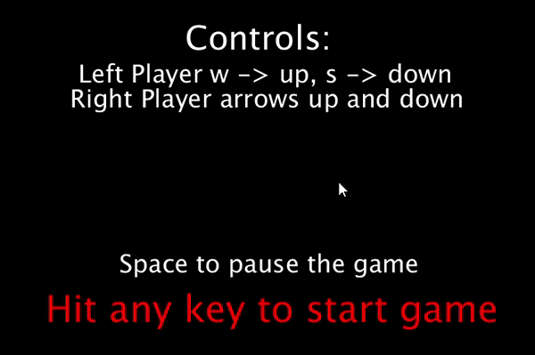

# Autor

Fernando Marcelo Alonso

## Idea general

El juego es de dos jugadores uno en cada lado de una "cancha" cada jugador controla un pala, esta pala solo se puede mover verticalmente con el objetivo de no dejar pasar una bola y también intentar dirigir la bola para que el contrario no pueda pararla. 

Hay un marcador y el primero que llegue a 10 puntos gana la partida.

## Implementación y argumentación

Para la implementación del juego he usado Processing 3.5.4, con la librearía Sound de processing además de las librearías nativas Math, random...

**Menú:** Al entrar al juego la primera pantalla que vemos es un menú donde se da información sobre los controles del juego además de indicar como se puede pausar el mismo y como se puede iniciar la partida, después de que un jugador gane se mostrará dicha pantalla con la información extra de quien ganó la partida.

**Controles:** Los controles que seleccione para el movimiento de las palas son la flecha hacia arriba y abajo para el jugador de la derecha y las teclas w y s para el jugador de la izquierda, elegí estas teclas pues se encuentran bastante alejadas para que no se molesten los jugadores, además de ser las más intuitivas pues en la mayoría de videojuegos se usan una de las dos combinaciones para el movimiento. 

**Detección del movimiento:** Para la detección del movimiento se usan los métodos keyPressed y keyReleased, cuando se pulsa una tecla de movimiento se mueve la pala en cada draw hasta que se detecte el KeyReleased, esto nos permite detectar varias teclas a la vez además de que el movimiento es más continuo e instantáneo.

**Pausa:** Seleccioné el espacio como tecla de pausa pues se encuentra en medio de las teclas de ambos jugadores, como añadido su gran tamaño ayuda a localizarla rápido y no perder tiempo en el momento de pausar.

**Marcador:** El marcador se encuentra en el centro arriba y muestra las puntuaciones de los usuarios, se colocó en ese sitio para no distraer y permitir una comprobación rápida.

**Movimiento inicial aleatorio:** Para el movimiento inicial de la pelota en el comienzo de cada punto opté por que la pelota tenga una velocidad reducida además de tener un ángulo sobre el eje x no muy pronunciado. La idea es que los jugadores no pierdan puntos en el "saque", además el movimiento aleatorio consigue que el jugador al que le toque recibir la bola no pueda colocar la raqueta a placer.

**Física pelota-raqueta:** El contacto de la pelota con la raqueta desvía la pelota en una dirección que varía en función del lugar del impacto, la pelota al contactar con el centro de la raqueta responde con un movimiento perpendicular a la raqueta, en cambio cuanto más lejos se produce el contacto del centro de la raqueta más ángulo tomará la pelota y más velocidad. Con esto premiamos los toques más arriesgados pues los toques cuanto más lejos impacten del centro de la pala más velocidad y ángulo tomarán, además esto permite controlar la velocidad del juego pues tocando la bola en el centro de la raqueta la ralentizamos, con lo que el juego adquiere más táctica y más mecánicas, permitiendo distinto estilos de juego más o menos agresivos.

**Espera entre puntos:** Entre punto y punto hay una espera de 0.4s(delay(400)) y después de la misma se lanza la pelota con el movimiento aleatorio, el objetivo de esto es no pillar a los jugadores de forma desprevenida si se distraen después de marcar un punto, además también se recolocan las palas en el centro para que ninguno de los jugadores tenga desventaja.

**Sonidos:** Cogí dos sonidos distintos uno para el contacto de la bola con la pala y otro para el contacto de la pelota con las paredes, ambos tienen una duración corta para que no ralenticen el ordenador, en herramientas se encuentran los links a los sonidos.

## Herramientas
- Processing 3.5.4
- SoundFile - librería de sonido de Processing
- Sonido pelota contra raqueta: https://freesound.org/people/NoiseCollector/sounds/4365/
- Sonido pelota contra pared: https://freesound.org/people/NoiseCollector/sounds/4366/

## GIF

